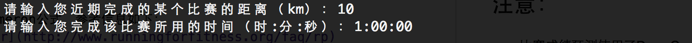
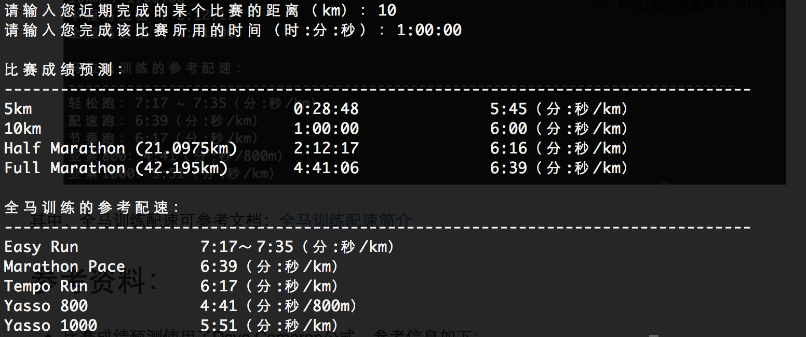

# Marathon Calculator

## 功能简介：

1. 根据近期完成的某个跑步比赛的距离和时间，来推算马拉松的完赛成绩，并给出相应的训练配速。
2. 设定马拉松比赛的预期目标，给出相应的训练配速。

## 使用方法：

1. 执行代码：`python3 marathonCalculator.py`
* 输入您曾经完成的某个跑步比赛的距离和时间，或者您预期的某个比赛的距离和时间。如下图：
	
* 程序将会推算出不同比赛的完赛成绩，以及相应的训练配速。
	

其中，全马训练配速可参考文档：[全马训练配速简介](./docs/全马训练配速简介.md)

## 参考资料：

* 比赛成绩预测使用了Dave Cameron公式，参考信息如下：
	* [Race Time Predictor](http://www.runningforfitness.org/faq/rp)
* 训练配速的计算参考了以下资料：
	* 《马拉松训练宝典》（作者：Bart Yasso）